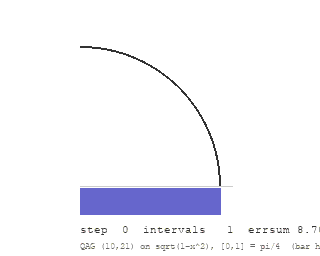
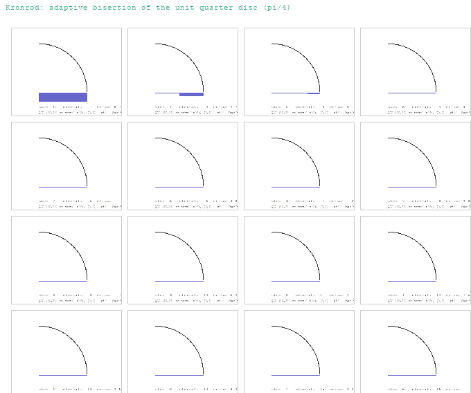

# Kronrod

[](https://www.rust-lang.org/)
[](https://doc.rust-lang.org/std/)
[](https://www.netlib.org/quadpack/)
[](https://oeis.org/)
[](https://www.rust-lang.org/tools/install)
[](LICENSE)


**Adaptive Gauss–Kronrod quadrature — the QUADPACK QAG engine, rebuilt from scratch in Rust (`std` only), and verified against the official Netlib constants with a full key-attestation battery.**

Kronrod is an adaptive numerical integrator. Given `f`, an interval `[a, b]` and
tolerances, it returns a quadrature estimate with an error estimate that the
caller can actually trust. The engine is a line-for-line port of the QAG
subroutine family from Piessens et al.'s QUADPACK (Netlib `qage.f`, `qpsrt.f`,
and the six `qkNN.f` rule routines), and the centerpiece is **Gauss–Legendre
rules computed from scratch by two independent methods** — Newton iteration on
the three-term Legendre recurrence, and the Golub–Welsch Jacobi
eigendecomposition — cross-checked against each other and against the
embedded official tables.

No crates. No `libm` beyond `std`. No wall clock anywhere: every artifact this
repo can produce is a pure function of the embedded constants, and re-running
anything — the battery, the PDF dossier, the SVG animations — produces
byte-identical output. That claim is not a slogan; it is attested in
`assets/attestation.txt` by a dual-run SHA-256 diff.

---

## What is in the box

| Module | What it is |
| --- | --- |
| `qk` | The one-step nested Gauss–Kronrod evaluation for all six rules `(G7,K15) … (G30,K61)`, plus the QUADPACK error estimator (`dqk21.f`'s `abserr` formula, verbatim) |
| `qag` | The adaptive driver: bisection of the worst subinterval, the `errbnd`/`errsum` loop, all five `ier` termination codes, and the exact `neval` evaluation-counting scheme |
| `qpsrt` | The list-reordering routine that maintains the descending error-estimate prefix and selects the next interval to bisect |
| `gauss` | Gauss–Legendre nodes and weights from scratch, **two independent methods** (Newton on the 3-term recurrence; Golub–Welsch cyclic-Jacobi eigendecomposition of the Legendre Jacobi matrix) |
| `tables` | The six embedded rule tables — **exact Netlib source digit strings**, parsed, with the odd/even layout semantics of `qk15.f` made explicit |
| `oracle` | 100-digit reference constants (π, e, √π) reconstructed from OEIS b-files, for exact-value comparison |
| `battery` | The verification battery: 16 integrands with known exact values, the quarter-disc convergence study, the rule-family × tolerance grid |
| `pdf` | A hand-rolled deterministic PDF 1.4 writer (base-14 fonts, fixed `/ID`, fixed creation dates) that typesets the report into the committed dossier |
| `svg` | The animated bisection trace (SMIL, no JS) and its static contact sheet; `tools/make_gif.py` rasterizes the 16 committed frames to `assets/anim.gif` / `assets/sheet.gif` (deterministic Pillow) |
| `crypto` | A zero-dependency SHA-256 (FIPS 180-4) used only for the attestation digests |
| `attest` | The dual-run byte-identity attestation |

Every number below is reproducible from the committed artifacts or from
`cargo test` / the CLI.

---

## The from-scratch centerpiece: Gauss–Legendre, two ways

An `n`-point Gauss rule is exact for every polynomial of degree `2n−1`. Its
nodes are the roots of the Legendre polynomial `P_n`, and the QUADPACK tables
embed them. Rather than trust the tables, `gauss.rs` recomputes them two
independent ways and agrees the two against each other **and** against the
embedded official digits:

- **Method A — Newton on the recurrence.** Seed each root at
  `x = cos((i−½)π/(n+½))`, then Newton-iterate the three-term Legendre
  recurrence `P_{k+1} = ((2k+1) x P_k − k P_{k−1})/(k+1)`, weighting with
  `w = 2 / ((1−x²) P_n′(x)²)`.
- **Method B — Golub–Welsch.** Build the `n×n` Jacobi matrix with
  `α_k = 0`, `β_k = k²/((2k−1)(2k+1))`, eigendecompose it with a cyclic
  Jacobi rotation, and read the nodes from the eigenvalues and the weights
  from the first row of the eigenvector matrix, `w_i = 2 v₀ᵢ²`.

The two methods never share code. On the quarter-disc integrand they agree to
`≤ 1e−14` on every node and weight for `n = 3 … 30`, and both reproduce the
embedded Netlib digits to the full stored precision:

```
n     max |nodeA − nodeB|   max wtA/wtB rel   vs table (nodes)  vs table (weights)
10    6.66e-16              5.62e-15          1.11e-16          4.58e-15
30    1.89e-15              6.84e-14          1.11e-16          4.57e-15
```

(full sweep, `n = 3 … 30`, in `assets/report.txt` SECTION 1). This is what
"from scratch" means here: the embedded (G10,K21) table is the
**official ground truth** used as a known-answer reference, and the
from-scratch Gauss rules are independently verified to reproduce it.

---

## The tables: provenance, and a digit-level finding

All six rules are embedded as **verbatim Netlib source digit strings** (no
rounding at parse time):

- `(G7,K15)`, `(G15,K31)`, `(G20,K41)`, `(G25,K51)`, `(G30,K61)` — the
  16-digit tables (`qk15.f`, `qk31.f`, `qk41.f`, `qk51.f`, `qk61.f`).
- `(G10,K21)` — the high-precision table (`dqk21.f`), which Netlib's own
  header comment records as *"evaluated with 80 decimal digit arithmetic by
  L. W. Fullerton, Bell Labs, November 1981"*. The file stores those
  evaluations as **33-digit** `d0` literals.

As an independent oracle, the battery cross-checks the embedded strings
against arbitrary-precision Gauss–Kronrod tables computed by the Laurie
method (Holoborodko, Multiprecision Computing Toolbox, 2011). The result is a
digit-level finding worth recording:

- The `(10,21)` outermost Kronrod node, embedded as
  `0.995657163025808080735527280689003`, matches the arbitrary-precision value
  `0.9956571630258080807355272806890028…` for its **first 32 significant
  digits** and differs only in the 33rd — the stored literal is the
  correctly-rounded 33-digit representation of the 80-digit evaluation.
- Each 16-digit literal agrees with its arbitrary-precision counterpart to
  15 significant digits (the 16th may carry a rounding bump), and all are
  correctly rounded.

So the tables are provably the right tables, to the digit the source stored.

The layout semantics that matter for any reimplementation (taken from
`qk15.f`): `xgk` stores `(K+1)/2` positive abscissae in descending order,
last entry the centre (0); **odd 0-based positions are the positive Gauss
nodes**, even positions the added Kronrod nodes. For **odd** `n` the centre
belongs to the Gauss rule, so the one-step sum seeds
`resg = f(c)·w_gauss_centre`; for even `n` it starts at 0. `tables.rs` makes
this explicit via `gauss_has_center()` / `gauss_pairs()` / `kronrod_pairs()`.

---

## The engine, and three behaviours the reference exhibits

The driver `qag.rs` is a faithful port: it bisects the subinterval with the
largest error estimate, maintains `area`/`errsum` incrementally, recomputes
`errbnd = max(epsabs, epsrel·|area|)` each step, and exits on
`ier ≠ 0` or `errsum ≤ errbnd`. The `ier` codes, the `50·epmach` roundoff
guard, the bad-behaviour test, and the `neval` scaling
(`(10·keyf+1)(2n+1)` for `keyf ≥ 2`, `30·n+15` for `keyf = 1`) are all
reproduced. Three behaviours stand out — each is pinned by a KAT:

**1. The IEEE overflow wall (faithful, not a bug).** Integrate
`f(x) = 1/√(1−x²)` on `[0,1]` — the quarter-circle arc, integral `π/2`. At
bisection depth 46 the outermost Kronrod node of the rightmost interval rounds
to **exactly** `x = 1`, the pole, so `f` returns `+inf`. The driver then
computes `errbnd = +inf`, and the IEEE comparison `inf ≤ inf` is `true`, so
the loop terminates *normally*:

```
ier = 0    result = +inf    abserr = +inf
neval = 1953   last = 47
```

A genuine double-precision `qage.f` does exactly this. The KAT pins every
field, and the report documents it as SECTION 6 rather than hiding it.

**2. The f64 exactness cliff.** `(G10,K21)` integrates `x^d` on `[-1,1]`
*exactly* (within `1e−14`) for even `d` through `d = 30` — but not `d = 32`.
The theoretical degree of exactness is higher; what the KAT pins is the
empirical floating-point cliff, which is what downstream code can actually
rely on.

**3. Bigger is not uniformly better at a fixed tolerance.** On the
quarter-disc at `epsrel = 1e−12`, the `(10,21)` rule reaches **15** correct
digits while the `(30,61)` rule reaches **14** — the bisection pattern, not
the per-step accuracy, decides where the run lands. The grid KAT asserts the
real ordering instead of a false monotonicity.

---

## Verification

Three layers, all committed and all reproducible:

1. **`cargo test` — 104 tests.** FIPS 180-4 SHA-256 vectors (including the
   1,000,000×`abc` KAT); 100-digit oracle constants; table structure (mass,
   symmetry, strict nesting, strict interlacing, 80-digit leading digits) plus
   the arbitrary-precision cross-check; two-method Gauss agreement and
   table match; the five bit-exact estimator KATs; polynomial exactness;
   `qpsrt` ordering invariants under a 200-step bisection simulation; the QAG
   KATs (exact integrals, all `ier` codes, `neval` accounting, key clamping,
   the overflow wall, interval reversal); PDF xref re-parse and byte-stability;
   SVG structure; attestation identity; and end-to-end determinism.
2. **`assets/dossier.pdf`** — the full report typeset by the hand-rolled PDF
   writer: four pages, base-14 fonts, fixed `/ID` and creation dates, verified
   by re-parsing with an independent PDF library (page count, object
   resolution, text extraction).
3. **`assets/attestation.txt`** — the report and the dossier are each
   generated **twice** in-process and SHA-256-compared. Empty diff, by
   construction, because nothing reads the clock:

```
run 1   : report.txt sha256 = 9d90e7bb7ef477b15c26edead27251b5813fb27c172fb5424d0fe70740531408
run 2   : report.txt sha256 = 9d90e7bb7ef477b15c26edead27251b5813fb27c172fb5424d0fe70740531408
run 1   : dossier.pdf sha256 = afbfee8780ee58fda4e8e65be71ecfbfa8337fc2b213c4eac3afa3dfd493441a
run 2   : dossier.pdf sha256 = afbfee8780ee58fda4e8e65be71ecfbfa8337fc2b213c4eac3afa3dfd493441a
verdict : BYTE-IDENTICAL (dual-run diff empty)
```

The convergence study (quarter-disc, `√(1−x²)`, exact value `π/4`) is the
cleanest single exhibit of the estimator: as `epsrel` tightens from `1e−1`
to `1e−13`, the correct-digit count climbs `5 → 15` with `ier = 0` throughout;
at `1e−14` and `1e−15` the `50·epmach` guard trips and the engine reports
`ier = 6` — telling the truth about the tolerance instead of silently
stalling. The bisection process itself is the animation:

<p align="center">
  
</p>

<p align="center">
  
</p>

*The adaptive bisection, 16 frames. Each step bisects the subinterval with the
largest error estimate (the rightmost bars); the error bars below the axis are
the per-interval estimates, scaled to the first frame's. The GIFs are a
deterministic raster of the committed SVG frames (`assets/anim.svg` is the
SMIL original, opens in any browser); `python tools/make_gif.py` reproduces
them byte-for-byte.*

---

## Building and running

Rust 1.94+ (any recent stable), no dependencies:

```
cargo test                       # 104 tests
cargo run --release -- demo      # quarter-disc pi/4 + Gauss from scratch
cargo run --release -- kats      # key known-answer summary
cargo run --release -- battery   # -> assets/report.txt
cargo run --release -- dossier   # -> assets/dossier.pdf
cargo run --release -- attest    # -> assets/attestation.txt
cargo run --release -- svg       # -> assets/anim.svg + assets/frames.svg
python tools/make_gif.py         # -> assets/anim.gif + assets/sheet.gif
```

Every artifact command prints the SHA-256 of what it wrote, so any re-run is
self-verifying.

## References

- R. Piessens, E. De Doncker-Kapenga, C. Überhuber, D. Kahaner,
  [*QUADPACK — A Subroutine Package for Automatic Integration*](https://doi.org/10.1007/978-3-642-61786-7),
  Springer-Verlag, 1983; Netlib sources `qage.f`, `qpsrt.f`, `qk15.f`,
  `qk31.f`, `qk41.f`, `qk51.f`, `qk61.f` from
  [Netlib QUADPACK](https://www.netlib.org/quadpack/).
- L. W. Fullerton, Bell Labs, *"Gauss quadrature weights and Kronrod
  quadrature abscissae and weights as evaluated with 80 decimal digit
  arithmetic"*, November 1981 (as distributed in
  [Netlib `dqk21.f`](https://www.netlib.org/quadpack/dqk21.f)).
- D. P. Laurie, [*"Calculation of Gauss–Kronrod Quadrature Rules"*](https://doi.org/10.1090/s0025-5718-97-00861-2),
  Math. Comp. 66 (219), 1133–1145, 1997.
- P. Holoborodko, *"Gauss–Kronrod Quadrature Nodes and Weights"*
  (arbitrary-precision Laurie-method tables, Multiprecision Computing
  Toolbox, 2011).
- G. H. Golub, J. H. Welsch, [*"Calculation of Gauss-Quadrature Rules"*](https://doi.org/10.1090/s0025-5718-69-99647-1),
  Math. Comp. 23 (106), 221–230, 1969.
- NIST, [*FIPS 180-4*: Secure Hash Standard](https://doi.org/10.6028/NIST.FIPS.180-4).
- Oracle constants: 100-digit digit strings of π, e and √π reconstructed from
  [OEIS](https://oeis.org/) b-files (π as [A000796](https://oeis.org/A000796)).

---

<p align="center">© 2026 Adithya N Raj</p>
